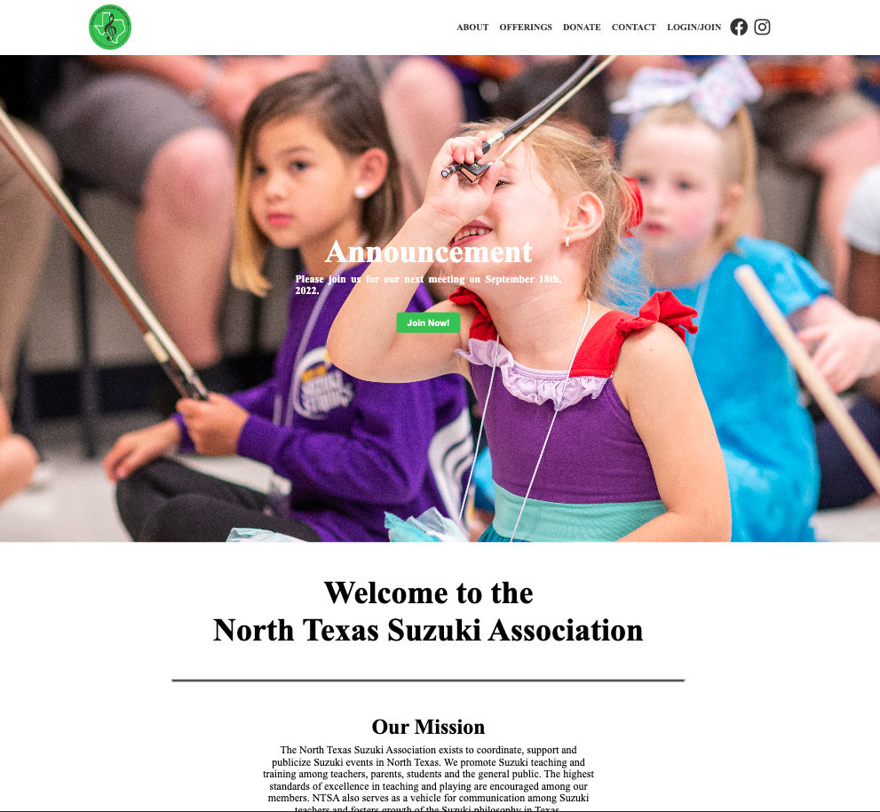
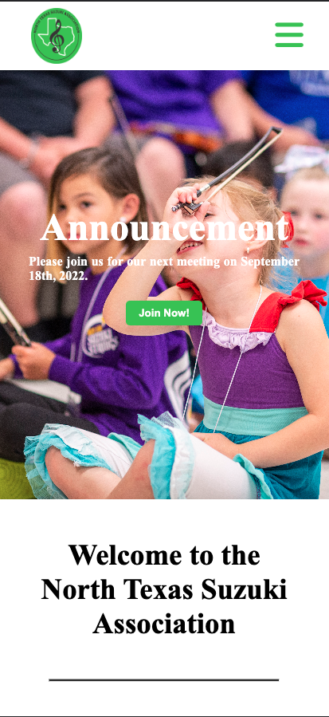

# North Texas Suzuki Association Website

[DEPLOYED SITE](https://www.northtexassuzukiassociation.org/)

[HEROKU LINK](https://obscure-springs-05343.herokuapp.com/)

[GITHUB REPO](https://github.com/cmd0160/ntsa_website)

## Table of Contents

- [Description](#description-of-the-project)
- [Languages](#languages-used)
- [Technologies & Libraries](#technologies-and-libraries-used)
- [Features](#features)
- [Future Development](#future-development)
- [Team Members](#team-members)

## Description Of the Project

This project featured a full-scale rebuild of the North Texas Suzuki Association's website. This site has been modernized with the use of MERN stack technologies, custom logo, modern CSS and Responsive design. It has features such as a member login/logout with authentication, a member directory with contact links, and queries and mutations for full CRUD capabilities.

## Languages Used

- HTML
- CSS
- JavaScript

## Technologies and Libraries Used

- Apollo Server/Client
- Express
- Font Awesome
- Framer Motion
- GraphQL
- Heroku
- MongoDB
- Mongoose
- Node.js
- React
- React-Router-Hash-Link
    - Smooth scroll offset

## Features

- Member Signup/login/logout capabilities.
- Full user authentication.
- Rotating home page hero image.
- Queries and mutations for retrieving, adding, updating, and deleting data.
- Fully responsive design considerations.

## Future Development

- Login Form password updating capabilities.
- Payment authorization for signup.
- Member Directory pagination.
- Framer Motion animation on the Home Page.
- Administration dashboard for ease of updating.

## Developer(s)

- **Cory Davis** - [Full Stack](https://github.com/cmd0160)

## Full Screen 

## Mobile

